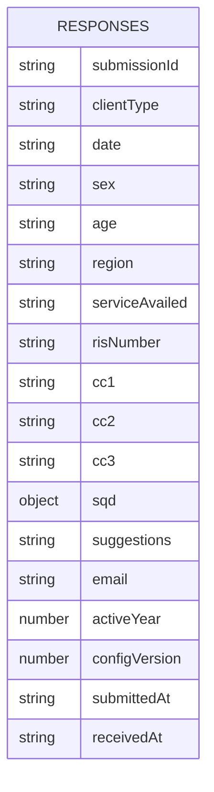
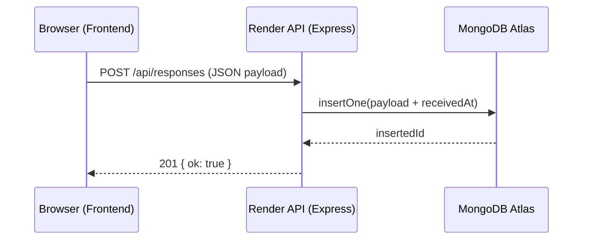
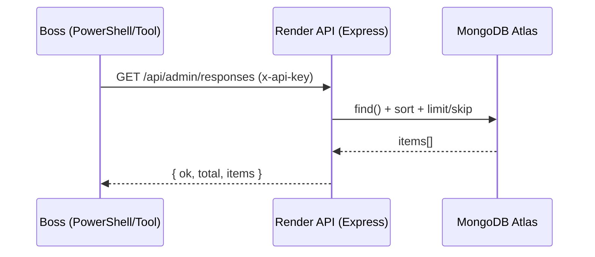

# Project Documentation – Polomolok Water District Survey

This document describes the full system: frontend (survey + admin), backend API, MongoDB storage, deployment, security model, and operational playbooks.

## Table of contents

- [System overview](#system-overview)
- [Repository structure](#repository-structure)
- [Frontend](#frontend)
  - [Routes](#routes)
  - [Survey flow](#survey-flow)
  - [Admin panel](#admin-panel)
  - [URL query prefill](#url-query-prefill)
  - [Backend submission behavior](#backend-submission-behavior)
  - [Field dictionary](#field-dictionary)
  - [Validation rules](#validation-rules)
- [Backend API (Express)](#backend-api-express)
  - [Environment variables](#environment-variables)
  - [Endpoints](#endpoints)
  - [API schemas and examples](#api-schemas-and-examples)
  - [Auth model (admin pull)](#auth-model-admin-pull)
  - [CORS](#cors)
  - [Security notes](#security-notes)
- [Database (MongoDB Atlas)](#database-mongodb-atlas)
  - [Collections](#collections)
  - [Indexes](#indexes)
  - [ERD](#erd)
  - [Data retention and privacy](#data-retention-and-privacy)
- [Diagrams](#diagrams)
  - [Architecture diagram](#architecture-diagram)
  - [Submission sequence](#submission-sequence)
  - [Admin pull sequence](#admin-pull-sequence)
- [Deployment](#deployment)
  - [Backend on Render](#backend-on-render)
  - [Frontend on GitHub Pages](#frontend-on-github-pages)
- [Operations](#operations)
  - [How the boss “pulls directly”](#how-the-boss-pulls-directly)
  - [Key rotation](#key-rotation)
  - [Monitoring](#monitoring)
  - [Backups and exports](#backups-and-exports)
  - [Troubleshooting](#troubleshooting)
  - [Troubleshooting matrix](#troubleshooting-matrix)
- [Developer guide](#developer-guide)
  - [Local development](#local-development)
  - [Release checklist](#release-checklist)

## System overview

The system is split into three parts:

- **Frontend**: a static single-page app (React UMD + Babel in-browser) that runs in the user’s browser.
- **Backend**: a Node/Express API that accepts submissions and provides secured admin endpoints for exports.
- **Database**: MongoDB Atlas storing documents in `pwd_survey.responses`.

## Repository structure

| Path | Description |
|------|-------------|
| `index.html` | Frontend HTML shell (loads React UMD, Babel, and `app.js`). |
| `app.js` | Frontend logic (survey + admin + submit). |
| `styles.css` | Frontend styles. |
| `backend/server.js` | Express API: submit + admin pull endpoints + MongoDB wiring. |
| `backend/package.json` | Backend dependencies and scripts. |
| `docs/PROJECT_DOCUMENTATION.md` | This document. |

## Frontend

### Routes

The frontend uses **hash-based routing**:

- `#/` → survey
- `#/admin` → admin panel

### Survey flow

The survey is a 5-step flow:

1. Client information
2. Citizen’s Charter (CC1–CC3)
3. Service Quality (SQD0–SQD8)
4. Suggestions + email (optional)
5. Review → Submit

### Admin panel

Admin mode is opened by clicking the header logo **5 times quickly**, which navigates to `#/admin`.

The admin UI edits **local device config** (saved to `localStorage`), such as:

- Survey year, title, intro
- Step labels
- Question text

### URL query prefill

You can prefill some Step 1 fields via query parameters:

- `date` (YYYY-MM-DD)
- `sex` (`male` or `female` — lowercase)
- `age`
- `region`
- `service` (maps to **Type of internal service availed**)
- `ris` or `risNumber` (maps to **RIS number**; either param name is accepted)

Example:

- `/?date=2026-03-11&sex=male&age=30&region=Davao&service=Health&ris=RIS-2026-001`

### Backend submission behavior

The frontend submits to the backend when `USE_BACKEND = true` in `app.js`.

Backend base URL resolution:

- If `window.__PWD_BACKEND_BASE_URL` is set **before** `app.js` loads, it is used.
- Otherwise, `app.js` has a default base URL (commonly local dev), and `index.html` can override it.

If the backend request fails, the frontend currently falls back to local storage (`localStorage`) so the user doesn’t lose the submission.

### Field dictionary

This is the **submission document** shape inserted into MongoDB by the backend. It is created in the frontend when the user submits.

#### Step 1: Client information

| Field | Type | Required | Notes |
|------|------|----------|------|
| `clientType` | string | Yes | Default: `government`. Options are defined in `CLIENT_TYPES` (`citizen`, `business`, `government`). |
| `date` | string | Yes | From the date input or URL prefill `date` (`YYYY-MM-DD`). |
| `sex` | string | Yes | `male` or `female` (lowercase). URL prefill lowercases and validates. |
| `age` | string | Yes | Stored as string (not enforced numeric). |
| `region` | string | Yes | Free text. |
| `serviceAvailed` | string | Yes | Free text; should match internal form wording (e.g. “Processing of Purchase Request No. PR-____”). URL prefill uses query param `service`. |
| `risNumber` | string | No | Optional; often prefilled from upstream handoff. URL prefill: query params `ris` or `risNumber`. |

#### Step 2: Citizen’s Charter (CC)

| Field | Type | Required | Allowed values / meaning |
|------|------|----------|--------------------------|
| `cc1` | string | Yes | `1`–`4` (see CC1 options). If `4`, then CC2/CC3 become N/A by automation. |
| `cc2` | string | Conditionally | If `cc1 !== "4"`, required. Values: `1`–`5` (`5` = N/A). |
| `cc3` | string | Conditionally | If `cc1 !== "4"`, required. Values: `1`–`4` (`4` = N/A). |

#### Step 3: Service Quality (SQD)

| Field | Type | Required | Notes |
|------|------|----------|------|
| `sqd` | object | Yes | Contains `sqd0`…`sqd8` values (strings). Each value is one of `1`–`6` where `6` = N/A. |

SQD keys:

- `sqd0`, `sqd1`, `sqd2`, `sqd3`, `sqd4`, `sqd5`, `sqd6`, `sqd7`, `sqd8`

#### Step 4: Suggestions

| Field | Type | Required | Notes |
|------|------|----------|------|
| `suggestions` | string | No | Free text. |
| `email` | string | No | Optional email. |

#### Submission metadata

| Field | Type | Set by | Notes |
|------|------|--------|------|
| `submissionId` | string | Frontend | Generated on submit; used for uniqueness and admin lookups. |
| `activeYear` | number | Frontend | From config; defaults to current year. |
| `configVersion` | number | Frontend | From config; currently defaults to 1. |
| `submittedAt` | string (ISO) | Frontend | ISO timestamp. |
| `receivedAt` | string (ISO) | Backend | Added by backend on insert. |

### Validation rules

The “Continue” / “Submit” button behavior is driven by `canMoveNext`:

#### Step 1 (Client information) – required

All must be non-empty after trimming:

- `clientType`, `date`, `sex`, `age`, `region`, `serviceAvailed`

`risNumber` is optional (may be empty).

#### Step 2 (Citizen’s Charter)

- `cc1` is required
- If `cc1 === "4"`: step passes automatically (CC2/CC3 forced to N/A via effect)
- Else: both `cc2` and `cc3` are required

#### Step 3 (SQD)

- All `sqd0`…`sqd8` must be non-empty (any of `1`–`6`)

#### Step 4 (Suggestions)

- Always passes (optional fields)

## Backend API (Express)

Backend lives in `backend/server.js`.

### Environment variables

Set these in Render (production) or `backend/.env` (local):

- `MONGODB_URI` (**required**): Atlas connection string (`mongodb+srv://...`) or local Mongo (`mongodb://...`)
- `MONGODB_DB` (**recommended**): `pwd_survey`
- `PORT` (Render provides this automatically; local default is 5175)
- `CORS_ORIGINS` (comma-separated): allowed frontend origins
- `ADMIN_API_KEY` (**required for admin endpoints**): shared secret used in header `x-api-key`

### Endpoints

Public:

- `GET /api/health` – checks DB connectivity and reports basic env flags
- `POST /api/responses` – inserts a submission (requires `submissionId`)

Admin (requires `x-api-key`):

- `GET /api/admin/responses?limit=100&skip=0&from=<ISO>&to=<ISO>`
  - `limit`: 1–1000
  - `skip`: 0+
  - `from`/`to`: compared to `receivedAt` (ISO strings)
- `GET /api/admin/responses/:submissionId`

### API schemas and examples

All responses are JSON.

#### `GET /api/health`

Success (200):

```json
{
  "ok": true,
  "env": {
    "hasMongoUri": true,
    "hasMongoDb": true,
    "adminApiKeyConfigured": true,
    "adminApiKeyLength": 64
  }
}
```

Failure (500) includes `error` and env flags.

#### `POST /api/responses`

Request body: the submission document (see [Field dictionary](#field-dictionary)). Must include `submissionId`.

Success (201):

```json
{ "ok": true, "insertedId": "..." }
```

Duplicate (409):

```json
{ "ok": false, "error": "Duplicate submissionId" }
```

Invalid request (400):

```json
{ "ok": false, "error": "Invalid JSON body" }
```

PowerShell example:

```powershell
$body = @{ submissionId = "sub_test_1"; clientType = "government"; date = "2026-03-11"; sex="male"; age="30"; region="Davao"; serviceAvailed="Health"; risNumber="RIS-2026-001"; cc1="4"; cc2="5"; cc3="4"; sqd=@{sqd0="6";sqd1="6";sqd2="6";sqd3="6";sqd4="6";sqd5="6";sqd6="6";sqd7="6";sqd8="6"}; suggestions=""; email=""; activeYear=2026; configVersion=1; submittedAt=(Get-Date).ToString("o") } | ConvertTo-Json -Depth 10
Invoke-RestMethod "https://polwd-survey.onrender.com/api/responses" -Method Post -ContentType "application/json" -Body $body
```

#### `GET /api/admin/responses`

Headers:

- `x-api-key: <ADMIN_API_KEY>`

Query params:

- `limit` (1–1000, default 100)
- `skip` (0+, default 0)
- `from` / `to` (ISO strings, compared against `receivedAt`)

Success (200):

```json
{
  "ok": true,
  "total": 123,
  "limit": 100,
  "skip": 0,
  "items": [ { "...": "..." } ]
}
```

PowerShell example:

```powershell
Invoke-RestMethod "https://polwd-survey.onrender.com/api/admin/responses?limit=100&skip=0" -Headers @{ "x-api-key" = "<ADMIN_API_KEY>" }
```

#### `GET /api/admin/responses/:submissionId`

PowerShell example:

```powershell
Invoke-RestMethod "https://polwd-survey.onrender.com/api/admin/responses/sub_d3839f02-..." -Headers @{ "x-api-key" = "<ADMIN_API_KEY>" }
```

### Auth model (admin pull)

Admin endpoints use a single shared key:

- Caller sends: `x-api-key: <ADMIN_API_KEY>`
- Server validates using a timing-safe comparison.

Do **not** put `ADMIN_API_KEY` into frontend code.

### CORS

Only origins listed in `CORS_ORIGINS` are allowed (browser requests). Non-browser requests without an `Origin` header (e.g., PowerShell) are allowed.

### Security notes

- **Do not commit secrets**: `backend/.env` must stay out of Git.
- **Admin key handling**:
  - Keep `ADMIN_API_KEY` server-side only.
  - Prefer sharing it via a secure channel.
  - Rotate it if leaked.
- **Transport security**:
  - Use HTTPS for remote access (Render provides HTTPS).
- **CORS is not auth**:
  - CORS only controls browsers; admin endpoints still require the API key.

## Database (MongoDB Atlas)

### Collections

- `responses` – one document per submitted survey

### Indexes

Created automatically on first use:

- Unique: `submissionId`
- Non-unique: `submittedAt`
- Non-unique: `receivedAt`

### ERD

MongoDB stores JSON documents. “ERD” here is a logical schema for the `responses` collection.



### Data retention and privacy

What is stored:

- The full survey submission document including free-text `suggestions` and optional `email`.

Recommendations:

- Treat responses as **sensitive** (contains personal data + opinions).
- Consider whether you should store `email` at all. If not needed, remove it before insert.
- Limit who has access to:
  - MongoDB Atlas project
  - Render environment variables
  - `ADMIN_API_KEY`

Retention:

- Currently there is **no automatic deletion**. If you need retention (e.g., delete after 12 months), implement a scheduled cleanup job or manual policy.

## Diagrams

### Architecture diagram

```mermaid
flowchart LR
  U[User Browser] --> FE[Frontend\nGitHub Pages / localhost]
  FE -->|POST /api/responses| API[Render API\npolwd-survey.onrender.com]
  API -->|insertOne| DB[(MongoDB Atlas\npwd_survey.responses)]
  Boss[Boss / Reporting] -->|GET /api/admin/responses\nx-api-key| API
  API -->|find()| DB
```

### Submission sequence



### Admin pull sequence



## Deployment

### Backend on Render

Render Web Service configuration:

- **Root Directory**: `backend`
- **Build Command**: `npm install`
- **Start Command**: `npm start`
- **Environment variables**: set `MONGODB_URI`, `MONGODB_DB`, `ADMIN_API_KEY`, `CORS_ORIGINS`

MongoDB Atlas requirement:

- Add IP Access List entry `0.0.0.0/0` (simple) or a more restrictive policy.

### Frontend on GitHub Pages

Frontend is static. For production, set backend base URL in `index.html` before `app.js`:

- `window.__PWD_BACKEND_BASE_URL = "https://polwd-survey.onrender.com";`

## Operations

### How the boss “pulls directly”

Boss can pull from anywhere using the Render URL and the API key.

PowerShell example:

```powershell
Invoke-RestMethod "https://polwd-survey.onrender.com/api/admin/responses?limit=100&skip=0" `
  -Headers @{ "x-api-key" = "<ADMIN_API_KEY>" }
```

### Key rotation

If the key is leaked:

1. Generate a new one
2. Update Render env var `ADMIN_API_KEY`
3. Redeploy/restart Render service (Render auto-restarts when env changes)
4. Distribute the new key securely

### Monitoring

Minimum recommended checks:

- `GET /api/health` should return `ok: true`
- Render deploy status should be healthy
- MongoDB Atlas cluster should show normal status

Free-tier Render note:

- Render free services can **spin down** with inactivity, which can cause a cold start delay (often up to ~50 seconds) on the first request.

### Backups and exports

Common export approach:

- Use the admin list endpoint to pull JSON and store it as a file on a schedule.

Example (PowerShell) – save to a JSON file:

```powershell
$key = Read-Host "ADMIN_API_KEY"
$data = Invoke-RestMethod "https://polwd-survey.onrender.com/api/admin/responses?limit=1000&skip=0" -Headers @{ "x-api-key" = $key }
$data.items | ConvertTo-Json -Depth 20 | Out-File -Encoding utf8 "responses-export.json"
```

For large datasets, paginate (`skip`) and combine outputs.

### Troubleshooting

- **CORS blocked**: ensure `CORS_ORIGINS` includes your frontend origin exactly (scheme + host + port).
- **Mongo connect errors**: verify `MONGODB_URI` and that Atlas Network Access allows connections (`0.0.0.0/0` for simple setups).
- **Admin endpoint says Missing x-api-key**: header must be named exactly `x-api-key`.
- **Admin endpoint says Invalid API key**: confirm `ADMIN_API_KEY` matches and service restarted.

### Troubleshooting matrix

| Symptom | Likely cause | Fix |
|--------|--------------|-----|
| Survey submits but nothing appears in Atlas | Frontend posting to wrong backend | Ensure `index.html` sets `window.__PWD_BACKEND_BASE_URL` to Render URL. |
| Browser console shows CORS error | `CORS_ORIGINS` missing your frontend origin | Add your exact origin (scheme+host+port) to Render env `CORS_ORIGINS`. |
| `/api/health` returns Mongo error | Atlas IP Access List / wrong URI | Add `0.0.0.0/0` (simple) and recheck `MONGODB_URI`. |
| Admin endpoint says Missing x-api-key | Header name wrong | Use header **exactly** `x-api-key`. |
| Admin endpoint says Invalid API key | Key mismatch | Rotate `ADMIN_API_KEY` in Render and share the new value. |

## Developer guide

### Local development

Backend:

```powershell
cd d:\1OJT\PWD\backend
npm install
cd ..
node backend/server.js
```

Frontend (simple static server on port 8080):

```powershell
cd d:\1OJT\PWD
npx serve . -l 8080
```

Then open `http://localhost:8080/`.

### Release checklist

- Update Render backend if `backend/` changes are pushed
- Verify `https://polwd-survey.onrender.com/api/health`
- Verify the frontend is pointing at Render (`window.__PWD_BACKEND_BASE_URL`)
- Submit one survey and confirm it appears in Atlas
- Verify admin pull endpoint works with the current `ADMIN_API_KEY`

